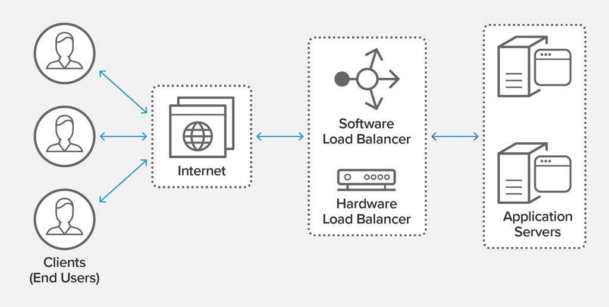

# Load Balancer

## What is Load Balancer ?

<b>Load balancing</b> refers to efficiently distributing incoming network traffic across a group of backend servers, also known as a server farm or server pool.

 

A load balancer acts as the “*traffic cop*” sitting in front of your servers and routing client requests across all servers capable of fulfilling those requests in a manner that maximizes speed and capacity utilization and ensures that no one server is overworked, which could degrade performance. If a single server goes down, the load balancer redirects traffic to the remaining online servers. When a new server is added to the server group, the load balancer automatically starts to send requests to it.

    

